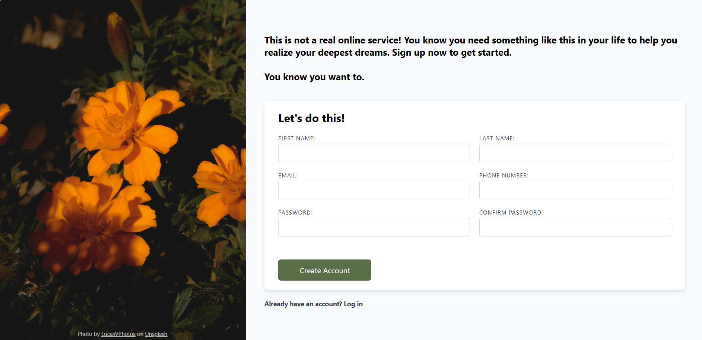

# Sign-upForm-ReactApp
sign up page react app created for 2025 advanced web programming project 3
this project was created to fit the requirements of an intermediate html/css project and a react app project.

project may be viewed by cloning the repository code onto your local machine and running npm start in the terminal.

here are the odin project html/css project requirements:
https://www.theodinproject.com/lessons/node-path-intermediate-html-and-css-sign-up-form

this project was built with react and uses usestate when the sign-up form is submitted.

because this project is a single page, when the "create account" button is clicked, the user's info is logged in the console to represent information that might be displayed on the user's account information page.

this project was created with react, js, and css.
